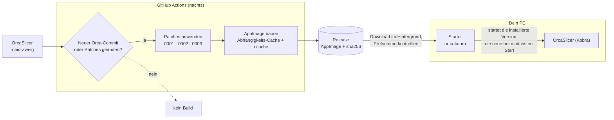

<div align="center">

# orca-kobra

**Nächtlicher OrcaSlicer für Linux mit ein paar kleinen Patches für den Anycubic Kobra S1 mit ACE 2 Pro und Spoolman – aktualisiert sich selbst.**

[](https://github.com/xNoVoSx/orca-kobra/actions/workflows/nightly.yml)
[](https://github.com/xNoVoSx/orca-kobra/actions/workflows/ci.yml)
[](https://github.com/xNoVoSx/orca-kobra/releases/latest)
[](LICENSE)
[](https://github.com/xNoVoSx/kobra-spoolman)

[English](README.md) · [Installation](docs/de/installation.md) · [Fehlersuche](docs/de/troubleshooting.md) · [Patches](docs/patches.md) · [Änderungen](CHANGELOG.md)

</div>

---

[OrcaSlicer](https://github.com/OrcaSlicer/OrcaSlicer) spricht über seinen Moonraker-Agenten schon
mit einem Kobra S1 unter [Rinkhals](https://github.com/rinkhals-community/Rinkhals). Ein paar Teile,
auf die [kobra-spoolman](https://github.com/xNoVoSx/kobra-spoolman) angewiesen ist, sind aber noch
nicht in Orca enthalten. Dieses Repository ergänzt sie als kleine Patches auf Orcas `main`-Zweig
und baut daraus jede Nacht ein Linux-AppImage:

- Der **Sync-Knopf** für Filamente wählt für jeden ACE-Slot genau das Spoolman-Profil statt eines
  allgemeinen Profils für den Materialtyp.
- **Plugins** dürfen unter Linux in Orcas Datenordner lesen und schreiben (Sandbox-Fix).
- Plugins können die **Slice-Statistik** pro Filament lesen – das kobra-spoolman-Plugin zeigt
  damit, wie viel jede Spule für die Platte braucht.

Ein Starter installiert den Build neben einem normalen Orca, hält ihn im Hintergrund aktuell und
kann auf die vorherige Version zurückfallen. Profile, Drucker und Plugins teilt er mit jeder
anderen Orca-Installation.

## So funktioniert es



| Teil | Was er macht |
|---|---|
| **[patches/](patches/)** | Drei kleine Patches auf OrcaSlicer `main`, jeder mit einer klaren Bedingung, wann er wegfallen kann. Details: [docs/patches.md](docs/patches.md) (englisch). |
| **[nightly.yml](.github/workflows/nightly.yml)** | Baut nur, wenn sich Orca oder die Patches geändert haben, überspringt Patches, die Orca schon enthält, veröffentlicht ein AppImage mit Prüfsumme. Details: [docs/build.md](docs/build.md) (englisch). |
| **[tools/orca-kobra](tools/orca-kobra)** | Starter: startet Orca sofort, lädt Updates im Hintergrund, behält die vorherige Version als Rückfall. |
| **[tools/install.sh](tools/install.sh)** | Installiert Starter, Menüeintrag „OrcaSlicer (Kobra)“ und ein eigenes Icon für den aktuellen Benutzer. |

## Patches

| Patch | Wirkung | Entfällt, wenn … |
|---|---|---|
| `0001` moonraker-lane-data-filament-id | Sync-Knopf wählt das Profil über `filament_id` aus Moonrakers `lane_data` (aus Orca-PR [#14423](https://github.com/OrcaSlicer/OrcaSlicer/pull/14423) von Broncosis) | #14423 übernommen ist |
| `0002` plugin-audit-linux-config-dir | Plugin-Sandbox sperrt nicht mehr ganz `~/.config/OrcaSlicer` wegen `.config` | Orca den Fehler behebt |
| `0003` plugin-host-slice-statistics | Neue, nur lesende Plugin-Funktion `orca.host.slice_statistics()`: Verbrauch pro Filament wie in der Vorschau-Legende, dazu die Ladevorgänge pro Filament | Orcas Plugin-API das selbst anbietet |

Patches, die Orca schon enthält, werden automatisch übersprungen und in den Release-Notizen so aufgeführt.

## Voraussetzungen

- **Linux x86_64** mit Desktop (gebaut wird auf Ubuntu 24.04; aktuelle Distributionen laufen).
- `curl`, `python3`, `sha256sum` und `flock` für den Starter – auf fast jedem System vorhanden.
- Optional: `rsvg-convert` oder ImageMagick (`magick`), damit das Icon auch als PNG installiert wird.
- Für den ganzen Ablauf mit Spoolman: [kobra-spoolman](https://github.com/xNoVoSx/kobra-spoolman)
  (Bridge und Orca-Plugin). Patch 0001 hilft auch ohne, solange etwas `lane_data.filament_id` in
  Moonraker füllt.

> [!NOTE]
> Meldungen des Starters und der Menüeintrag sind deutsch. Die Patches und OrcaSlicer selbst
> betrifft das nicht – Orca richtet sich wie gewohnt nach deiner Spracheinstellung.

## Schnellstart

```bash
git clone https://github.com/xNoVoSx/orca-kobra && cd orca-kobra
tools/install.sh
```

Danach **„OrcaSlicer (Kobra)“** aus dem Anwendungsmenü starten. In Orca unter
**Druckereinstellungen → Grundlegende Informationen → Erweitert** (Expertenmodus)
**Printer Agent = Moonraker** einstellen, damit der Sync-Knopf Patch 0001 nutzt.

Ganze Anleitung: **[docs/de/installation.md](docs/de/installation.md)**.

## Dokumentation

| | |
|---|---|
| [Installation](docs/de/installation.md) | Starter, Updates und Rückfall, Handinstallation, Entfernen |
| [Patches](docs/patches.md) | Was jeder Patch ändert und warum, Plugin-API, Patches bearbeiten und prüfen (englisch) |
| [Build](docs/build.md) | Nächtlicher Workflow, wann gebaut wird, Caches, Releases, Build im Fork (englisch) |
| [Fehlersuche](docs/de/troubleshooting.md) | Häufige Probleme und Lösungen |
| [Änderungen](CHANGELOG.md) | Verlauf von Patches, Build und Starter (englisch) |
| [Mitmachen](CONTRIBUTING.md) | Patch vorschlagen oder aktualisieren (englisch) |

## Danke

[OrcaSlicer](https://github.com/OrcaSlicer/OrcaSlicer) ·
Orca-PR [#14423](https://github.com/OrcaSlicer/OrcaSlicer/pull/14423) von Broncosis ·
[Rinkhals](https://github.com/rinkhals-community/Rinkhals) ·
[Spoolman](https://github.com/Donkie/Spoolman)

## Lizenz

[AGPL-3.0](LICENSE) wie OrcaSlicer selbst. Der Quellcode jedes Builds ist der in seinen
Release-Notizen genannte Orca-Commit plus die Patches in diesem Repository.
Kein offizielles Projekt von Anycubic oder OrcaSlicer.
