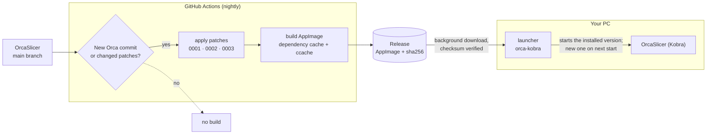

<div align="center">

# orca-kobra

**Nightly OrcaSlicer for Linux with a few small patches for the Anycubic Kobra S1 with ACE 2 Pro and Spoolman — self-updating.**

[](https://github.com/xNoVoSx/orca-kobra/actions/workflows/nightly.yml)
[](https://github.com/xNoVoSx/orca-kobra/actions/workflows/ci.yml)
[](https://github.com/xNoVoSx/orca-kobra/releases/latest)
[](LICENSE)
[](https://github.com/xNoVoSx/kobra-spoolman)

[Deutsch](README.de.md) · [Installation](docs/installation.md) · [Patches](docs/patches.md) · [Build](docs/build.md) · [Changelog](CHANGELOG.md)

</div>

---

[OrcaSlicer](https://github.com/OrcaSlicer/OrcaSlicer) can already talk to a Kobra S1 running
[Rinkhals](https://github.com/rinkhals-community/Rinkhals) through its Moonraker agent. A few pieces
that [kobra-spoolman](https://github.com/xNoVoSx/kobra-spoolman) relies on are not upstream yet.
This repository adds them as small patches on top of Orca's `main` branch and builds a Linux
AppImage from it every night:

- The filament **sync button** picks the exact Spoolman profile for each ACE slot instead of a
  generic one for the material type.
- **Plugins** can read and write in Orca's data folder on Linux (sandbox fix).
- Plugins can read the **slice statistics** per filament — the kobra-spoolman plugin uses them to
  show what each spool needs for the plate.

A launcher installs it next to a regular Orca, keeps it up to date in the background and falls
back to the previous version if needed. Profiles, printers and plugins are shared with any other
Orca installation.

## How it works



| Part | What it does |
|---|---|
| **[patches/](patches/)** | Three small patches on OrcaSlicer `main`, each one with a clear condition for when it can be dropped. Details: [docs/patches.md](docs/patches.md). |
| **[nightly.yml](.github/workflows/nightly.yml)** | Builds only when Orca or the patches changed, skips patches that Orca already contains, publishes an AppImage with checksum. Details: [docs/build.md](docs/build.md). |
| **[tools/orca-kobra](tools/orca-kobra)** | Launcher: starts Orca immediately, downloads updates in the background, keeps the previous version as a fallback. |
| **[tools/install.sh](tools/install.sh)** | Installs the launcher, the menu entry "OrcaSlicer (Kobra)" and its own icon for the current user. |

## Patches

| Patch | Effect | Obsolete once … |
|---|---|---|
| `0001` moonraker-lane-data-filament-id | Sync button picks the preset by `filament_id` from Moonraker's `lane_data` (from Orca PR [#14423](https://github.com/OrcaSlicer/OrcaSlicer/pull/14423) by Broncosis) | #14423 is merged |
| `0002` plugin-audit-linux-config-dir | Plugin sandbox no longer blocks the whole `~/.config/OrcaSlicer` because of `.config` | Orca fixes the bug |
| `0003` plugin-host-slice-statistics | New read-only plugin API `orca.host.slice_statistics()`: usage per filament as in the preview legend, plus loads per filament | Orca's plugin API offers it itself |

Patches that Orca already contains are skipped automatically and listed as such in the release notes.

## Requirements

- **Linux x86_64** with a desktop (the AppImage is built on Ubuntu 24.04; recent distributions work).
- `curl`, `python3`, `sha256sum` and `flock` for the launcher — present on almost every system.
- Optional: `rsvg-convert` or ImageMagick (`magick`) so the icon is also installed as PNG.
- For the full workflow with Spoolman: [kobra-spoolman](https://github.com/xNoVoSx/kobra-spoolman)
  (bridge and Orca plugin). Patch 0001 also helps without it, as long as something fills
  `lane_data.filament_id` in Moonraker.

> [!NOTE]
> The launcher's messages and the menu entry are in German. The patches and OrcaSlicer itself are
> not affected — Orca uses your language setting as usual.

## Quick start

```bash
git clone https://github.com/xNoVoSx/orca-kobra && cd orca-kobra
tools/install.sh
```

Then start **"OrcaSlicer (Kobra)"** from the application menu. In Orca set
**Printer settings → Basic information → Advanced** (advanced mode) **Printer agent = Moonraker**
so the sync button uses patch 0001.

Full guide: **[docs/installation.md](docs/installation.md)**.

## Documentation

| | |
|---|---|
| [Installation](docs/installation.md) | Launcher, updates and fallback, manual install, uninstall |
| [Patches](docs/patches.md) | What each patch changes and why, plugin API reference, editing and checking patches |
| [Build](docs/build.md) | Nightly workflow, when it builds, caches, releases, building in a fork |
| [Troubleshooting](docs/troubleshooting.md) | Common problems and how to solve them |
| [Changelog](CHANGELOG.md) | History of patches, build and launcher |
| [Contributing](CONTRIBUTING.md) | How to propose or update a patch |

## Credits

[OrcaSlicer](https://github.com/OrcaSlicer/OrcaSlicer) ·
Orca PR [#14423](https://github.com/OrcaSlicer/OrcaSlicer/pull/14423) by Broncosis ·
[Rinkhals](https://github.com/rinkhals-community/Rinkhals) ·
[Spoolman](https://github.com/Donkie/Spoolman)

## License

[AGPL-3.0](LICENSE), like OrcaSlicer itself. The source of every build is the Orca commit named in
its release notes plus the patches in this repository.
Not affiliated with Anycubic or OrcaSlicer.
